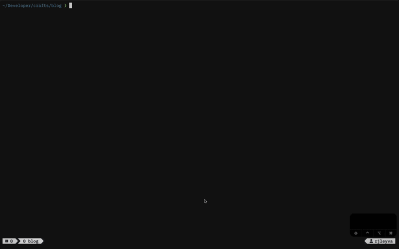

# RJ Leyva's dotfiles 🌴

Managed with [GNU Stow](https://www.gnu.org/software/stow/),
featuring carefully curated configurations for a productive development workflow.
Built for consistency across machines with easy replication.



---

## Tools & Stack

| Category            | Tools                                 |
| ------------------- | ------------------------------------- |
| **Editor**          | Neovim 0.11.3+ with native LSP        |
| **Terminal**        | WezTerm with vague theme              |
| **Shell**           | Zsh + Powerlevel10k                   |
| **Multiplexer**     | Tmux with vim keybindings             |
| **Version Control** | Git and JJ(Jujutsu)                   |
| **Formatters**      | Prettier, Black, Stylua, gofmt, shfmt |
| **Linters**         | ESLint, Ruff, Codespell               |
| **Package Manager** | Homebrew                              |

---

## Quick Start

```bash
/bin/bash -c "$(curl -fsSL https://raw.githubusercontent.com/rjleyva/dotfiles-macos/main/scripts/dev-setup.sh)"
```

This will:

- Install Homebrew (Apple Silicon ready) and add it to your path.
- Install core development tools such as Neovim, tmux, Lua and Marksman language
  servers, Python and formatters, etc.
- Install global npm language servers.
- Clone this repository into ~/dotfiles-macos and symlink configs with Stow.

## Usage

```bash
# Remove symlinks (safe, non-destructive)
stow -D .
# Symlink selectively
stow zsh git nvim
```

## Rollback

To remove all symlinks, uninstall the packages, and delete this repository, run:

```bash
/bin/bash -c "$(curl -fsSL https://raw.githubusercontent.com/rjleyva/dotfiles-macos/main/scripts/dev-rollback.sh)"
```

## Keymaps

You can also run `:map` to list all available key mappings.

## General Editing

| Keymap       | Mode   | Action           | Description                  |
| ------------ | ------ | ---------------- | ---------------------------- |
| `jk`         | Insert | Exit insert mode | Quick escape alternative     |
| `<leader>+`  | Normal | Increment number | Increase number under cursor |
| `<leader>-`  | Normal | Decrement number | Decrease number under cursor |
| `<leader>n`  | Normal | New buffer       | Create empty buffer          |
| `<leader>cs` | Normal | Clear search     | Remove search highlights     |
| `<leader>cm` | Normal | Show messages    | Display message history      |

---

## File Navigation

| Keymap       | Mode   | Action          | Description                  |
| ------------ | ------ | --------------- | ---------------------------- |
| `<leader>ff` | Normal | Find file       | Use `:find` with wildmenu    |
| `<leader>fg` | Normal | Grep project    | Search across multiple files |
| `<leader>fb` | Normal | Buffer switcher | Select from open buffers     |
| `\`          | Normal | Toggle explorer | Show/hide Netrw file tree    |

---

## LSP Features

### Code Navigation

| Keymap | Mode   | Action           | Description           |
| ------ | ------ | ---------------- | --------------------- |
| `grr`  | Normal | References       | Find all references   |
| `gri`  | Normal | Implementation   | Go to implementation  |
| `grt`  | Normal | Type definition  | Go to type definition |
| `gO`   | Normal | Document symbols | Show outline          |
| `K`    | Normal | Hover            | Show documentation    |

### Code Actions

| Keymap  | Mode          | Action         | Description             |
| ------- | ------------- | -------------- | ----------------------- |
| `grn`   | Normal        | Rename         | Rename symbol           |
| `gra`   | Normal/Visual | Code action    | Show available actions  |
| `<C-s>` | Insert        | Signature help | Show function signature |

### Diagnostics

| Keymap       | Mode   | Action              | Description                  |
| ------------ | ------ | ------------------- | ---------------------------- |
| `[d`         | Normal | Previous diagnostic | Jump to previous issue       |
| `]d`         | Normal | Next diagnostic     | Jump to next issue           |
| `<leader>xq` | Normal | Quickfix list       | Send diagnostics to quickfix |
| `<leader>xl` | Normal | Location list       | Send diagnostics to loclist  |
| `<leader>xf` | Normal | Float window        | Show diagnostic in float     |
| `<leader>xd` | Normal | Toggle diagnostics  | Enable/disable for buffer    |
| `<leader>xt` | Normal | Toggle virtual text | Show/hide inline diagnostics |

---

## Git Integration

| Keymap       | Mode   | Action           | Description             |
| ------------ | ------ | ---------------- | ----------------------- |
| `<leader>gb` | Normal | Blame line       | Show git blame for line |
| `<leader>gx` | Normal | Toggle blame     | Toggle inline blame     |
| `<leader>ga` | Normal | Blame buffer     | Show buffer blame       |
| `<leader>gs` | Normal | Stage hunk       | Stage current hunk      |
| `<leader>gu` | Normal | Unstage hunk     | Undo stage hunk         |
| `<leader>g.` | Normal | Stage file       | Stage entire file       |
| `<leader>g,` | Normal | Unstage file     | Unstage entire file     |
| `<leader>gr` | Normal | Reset hunk       | Discard hunk changes    |
| `<leader>gf` | Normal | Reset file       | Discard file changes    |
| `<leader>gp` | Normal | Preview hunk     | Show hunk diff          |
| `<leader>gl` | Normal | Toggle line HL   | Highlight changed lines |
| `<leader>gn` | Normal | Toggle number HL | Highlight line numbers  |

---

## Code Formatting

| Keymap       | Mode          | Action | Description              |
| ------------ | ------------- | ------ | ------------------------ |
| `<leader>cf` | Normal/Visual | Format | Format file or selection |

---

## Additional Features

### Text Manipulation

| Keymap         | Mode   | Action             | Description                        |
| -------------- | ------ | ------------------ | ---------------------------------- |
| `ys{motion}`   | Normal | Add surround       | Surround text with brackets/quotes |
| `yss`          | Normal | Surround line      | Surround entire line               |
| `ds{char}`     | Normal | Delete surround    | Remove surrounding characters      |
| `cs{old}{new}` | Normal | Change surround    | Change surrounding characters      |
| `S`            | Visual | Surround selection | Wrap visual selection              |

### Treesitter

| Keymap      | Mode          | Action              | Description                     |
| ----------- | ------------- | ------------------- | ------------------------------- |
| `<C-space>` | Normal/Visual | Increment selection | Expand to next syntax node      |
| `<BS>`      | Visual        | Decrement selection | Shrink to previous node         |
| `]f`        | Normal        | Next function       | Jump to next function start     |
| `[f`        | Normal        | Prev function       | Jump to previous function start |

### Refactoring

| Keymap      | Mode   | Action        | Description              |
| ----------- | ------ | ------------- | ------------------------ |
| `<leader>r` | Visual | Refactor menu | Show refactoring options |

### Database

| Keymap       | Mode   | Action         | Description                 |
| ------------ | ------ | -------------- | --------------------------- |
| `<leader>db` | Normal | Open DB UI     | Launch database interface   |
| `<leader>dt` | Normal | Toggle DB UI   | Show/hide database UI       |
| `<leader>da` | Normal | Add connection | Add database connection     |
| `<leader>df` | Normal | Find DB buffer | Navigate to database buffer |

### REST Client

| Keymap       | Mode   | Action       | Description                  |
| ------------ | ------ | ------------ | ---------------------------- |
| `<leader>rs` | Normal | Send request | Execute HTTP request         |
| `<leader>ra` | Normal | Send all     | Execute all requests in file |
| `<leader>rb` | Normal | Scratchpad   | Open REST scratchpad         |

---
